# Self-Driving Car Engineer Nanodegree


## Project: Advanced Lane Finding
## Name: Ahsan habib  

---

**Advanced Lane Finding Project**

The goals / steps of this project are the following:

* Compute the camera calibration matrix and distortion coefficients given a set of chessboard images.
* Apply a distortion correction to raw images.
* Use color transforms, gradients, etc., to create a thresholded binary image.
* Apply a perspective transform to rectify binary image ("birds-eye view").
* Detect lane pixels and fit to find the lane boundary.
* Determine the curvature of the lane and vehicle position with respect to center.
* Warp the detected lane boundaries back onto the original image.
* Output visual display of the lane boundaries and numerical estimation of lane curvature and vehicle position.


## [Rubric](https://review.udacity.com/#!/rubrics/571/view) Points

### Here I will consider the rubric points individually and describe how I addressed each point in my implementation.  

---


### Camera Calibration

#### 1. Briefly state how you computed the camera matrix and distortion coefficients. Provide an example of a distortion corrected calibration image.

The code for this step is contained in the second code cell of the IPython ("P2.ipynb") notebook located in root dir of my project. The output of all camera calibration images are in output_images/camera_cal dir.  

I start by preparing 3D "object points", which will be the (x, y, z) coordinates of the chessboard corners in the world. Here I am assuming the chessboard is fixed on the (x, y) plane at z=0, such that the object points are the same for each calibration image.  Thus, `objp` is just a replicated array of coordinates, and `objpoints` will be appended with a copy of it every time I successfully detect all chessboard corners in a test image.  `imgpoints` will be appended with the (x, y) pixel position of each of the corners in the image plane with each successful chessboard detection.  

I then used the output `objpoints` and `imgpoints` to compute the camera calibration and distortion coefficients using the `cv2.calibrateCamera()` function.  I applied this distortion correction to the test image using the `cv2.undistort()` function and obtained an undistorted image. Then, I perform a perspective transformation to transform the image so that it looks like the actual image without and distortion. Here is an example of original  image, undistort image and warped image.


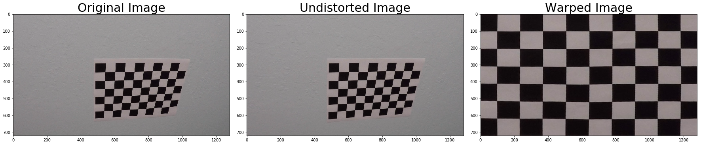 


### Pipeline (single images)

#### 1. Provide an example of a distortion-corrected image.

This step is similar to what I have done above on camera calibration. I have used Calibration10.jpg as a sample to get the calibration coefficients and apply them to test image and videos. I have defined `undistort()` function for this purpose. Later, this function will be used in the image and video processing pipeline.

An example of applying `undistort()` function on test image (test6.jpg) is shown below:
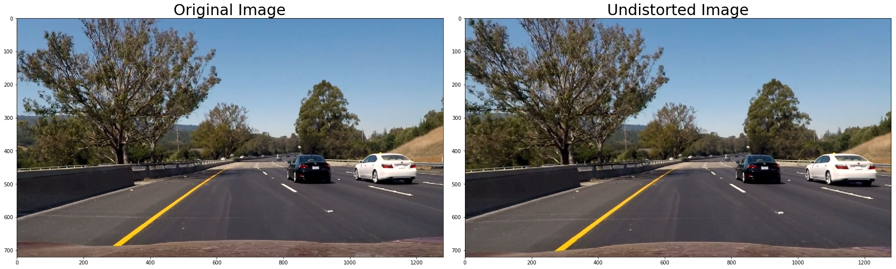  


#### 2. Describe how (and identify where in your code) you used color transforms, gradients or other methods to create a thresholded binary image.  Provide an example of a binary image result.

I have done all quizs in the video sections such as sobel operator, mag threshold for gradients and HLS for color. Out of those exercises, it shows S channel shows good promise in converting an image to a thresholded binary image. I have used `hls_select()` function first for this purpose. The threshold I used is (90,255), which gives good result. Here is an example, where I have applied S channel to a distortion corrected test6.jpg image and output image is shown below.

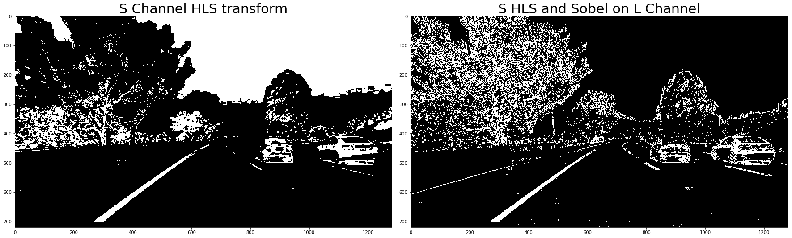

It works for most test images. However it fails on fitting the polynomial for test2.jpg. Therefore, as recommended and given some code snippent in the tuturial, I have combined sobel operator with color transformation. The combined function is called `color_xform`. Here is a comparison to apply only S Channel transform and combined transformed on test2.jpg

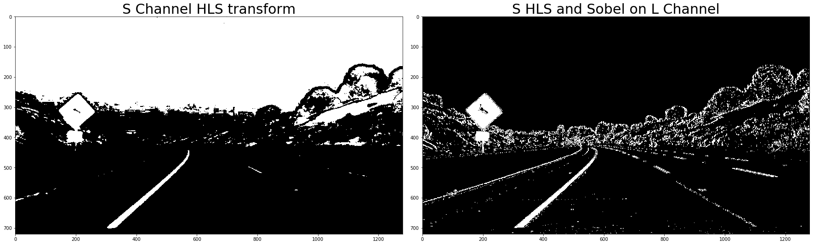

#### 3. Describe how (and identify where in your code) you performed a perspective transform and provide an example of a transformed image.

For perspective transform, I have developed  `warper()` function that takes as input image (`img`), computes source (`src`) and destination (`dst`) points.  I chose the hardcode the source and destination points in the following manner:

```python
src = np.float32(
    [[(img_size[0] / 2) - 55, img_size[1] / 2 + 100],
    [((img_size[0] / 6) - 10), img_size[1]],
    [(img_size[0] * 5 / 6) + 60, img_size[1]],
    [(img_size[0] / 2 + 55), img_size[1] / 2 + 100]])
dst = np.float32(
    [[(img_size[0] / 4), 0],
    [(img_size[0] / 4), img_size[1]],
    [(img_size[0] * 3 / 4), img_size[1]],
    [(img_size[0] * 3 / 4), 0]])
```

This resulted in the following source and destination points:

| Source        | Destination   | 
|:-------------:|:-------------:| 
| 585, 460      | 320, 0        | 
| 203, 720      | 320, 720      |
| 1127, 720     | 960, 720      |
| 695, 460      | 960, 0        |

I verified that my perspective transform was working as expected by drawing the `src` and `dst` points onto all test images and its warped counterpart to verify that the lines appear parallel in the warped image.

Here is an example of the warped image for test6.jpg

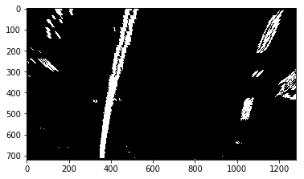

Ideally, `src` and `dst` shold be the input parameter of `warper()` function. However, as I used hardcoded (given in template), I used that inside the fuction.

#### 4. Describe how (and identify where in your code) you identified lane-line pixels and fit their positions with a polynomial?

I follow the sliding window approach from video tutorial to identify lane-line pixels and fit their positions with a polynomial. The functions developed are `find_lane_pixels()` and `fit_polynomial()`. I have applied these to all test images and it works fairly well. It's a bit challenge and  does not work well for the challenge videos.

Here is an example of fitting the polynomial on test6.jpg

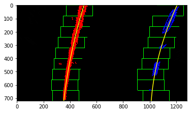 

As it was mentioend that test2.jpg failed when I applied only `hls_select` and when that image was used in the pipeline, the polyfit was incorrect. Here is an example of failed polynomial (left image) for test2.jpg if only Color transformed is done. After apply combined technique of  S channel and Sobel gradient, the polynomial fits well for test2.jpg (right image)

<p float="left">
  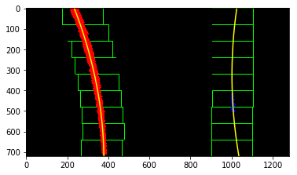
  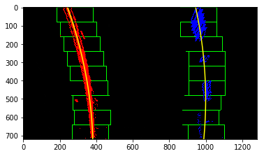 
</p>


Update on 8.7.18:
I have created two `polyfit` functions with or without `histogram` and `sliding window search`. I applied it on project video based on `good fit` from previous information. However, the result was not satisfactory. Therefore, I have decided to run `full polyfit` every time. At least, the lane marker does not bleed cross the real lanes.

#### 5. Describe how (and identify where in your code) you calculated the radius of curvature of the lane and the position of the vehicle with respect to center.

For this, first I apply `fit_polynomial` function developed as described above. Then, I used the following approximation to estimate the radius in meter.

	ym_per_pix = 30/720 # meters per pixel in y dimension
    xm_per_pix = 3.7/700 # meters per pixel in x dimension

It measures radius for left and right side of the lane. As, the lanes are parallel, I have taken the average out of the two values.

Once I apply this on test6.jpg, I get the radius value as below:

Radius: 919.19m 

Update on 8.7.18:
I have implemented position of the vehicle with respect to the center of the lane. For that, I used the left and right fit of lane and calculate the center by the average value of the two. The camera is mounted at the middle of the vehicle. Therefore, the distance between car position and the center of the lane is calculated from the difference of the two.

        center_dist =  (car_pos-center_lane)

		In meter, 
		center_dist =  (car_pos-center_lane) * xm_per_pix, where xm_per_pix is the meter per pixel in x dimention as described above.

Now, we have the center shown as:

Car is:  0.22m from center


#### 6. Provide an example image of your result plotted back down onto the road such that the lane area is identified clearly.

Now is the fun part. With the help of the tutorial, I have defined function `map_lane()`, which takes the warped image, fill the area between the detected lane, `un-warp` it and overlay on top of the original image. For this, I needed Minv, which is the inverse perspective transformation, where the `perspective transformation` function (`warper`) is called with `src` and `dst` or used in inverse order. I put both inside `warper()` function instead of calling them separately and it returns `Minv` that will be used in `map_lane()` function. Here is an example of my result on a test image:

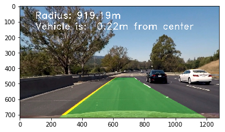 


---

### Pipeline (video)

I have defined `process_image()` to process each image frame of a video. I have used a flag to show the polyfit line for test images but not for the videos. It can be handled in a better way.

#### 1. Provide a link to your final video output.  Your pipeline should perform reasonably well on the entire project video (wobbly lines are ok but no catastrophic failures that would cause the car to drive off the road!).

[Project video ](https://www.dropbox.com/s/uqkyh223grhk880/output_project_video.mp4?dl=0)

The link is in my project workspace. I see no catastrophic failure in the main project video. However, it does not work well for the challenge videos. I have applied the pipeline to challenge video and harder challenge video. It fails on many frames for challenge video and most frames in harder challenge. 

[Challenge video ](https://www.dropbox.com/s/b4zrep04myxphir/output_challenge_video.mp4?dl=0)

[Harder Challenge video ](https://www.dropbox.com/s/trgznhm5mmclb2q/output_harder_challenge_video.mp4?dl=0)

The issues I see here:

* Some times, the lane has strong line in the middle of a lane as result of road maintenance and it's mistakenly taken as a lane marker
* The lanes are curved too much and polyfit does not fit with the lane well
* Curve of lane changes direction pretty frequently

Update on 8.7.18:
In the previous submission, there are some areas where the lane marker was bleeding across lane boundary. This is due to the impact of shadow and incorrect lane identification from warped binary. However, those data were not discarded.

Based on the reviewer feedback, I have fixed it (it was an improvement plan before). To do that, I have follow the tips from the project to create a class of Line that tracks the `fits` of left and right side of lanes. Then, we compare if some fits widely deviate from the previous one and if so, I discard those data. I also take average of last 10 best fits. It turns out to work well.

Based on reviewer feedback, I have also fixed the issue to draw lane on `undistort` image, instead of the `original` image.
 

---

### Discussion

####  Briefly discuss any problems / issues you faced in your implementation of this project.  Where will your pipeline likely fail?  What could you do to make it more robust?

In the beginning, I found it's not clear whether I should be improving on top of last project or it's a totally different and unrelated project comparing to the lane finding project. It was soon clarified by the mentor in the chat channel. It's good that a lot of code/functions were given in the tutorial sessions, yet, it took some time to understand the flow of the pipeline. I struggled a lot on polyfit, however that tunrned out to be a bug in my code. After that, to make it work for most of the test images was straightforward. 

The current pipeline fails in challenge vidoes as, I think, the poly fit fails. I need to dig deep whether I need to better than 2nd order poly fit or combining multiple thresholded operation to create binary image. The project outline provides techniques to ignore lines that do not fit well. I haven't done this improvement in my project. I have a plan to do it. Hence, here is my improvement plan:

   * I have combined Sobel and S channel color transformation that works for all test images as well as project video. I plan to improve it using other techniques mentioned in the tutorial. Not sure how much it will help on the harder challenge video
   * Implement the recommendation to track the lines that fits, ignore the ones that do not fit and reset baseline as needed
   * Try higher degree polynomial fit for roads that curve frequently as shown in the harder challenge video
   * I saw some very high curvature radius in the video. I need to de-compile the videos and analyze frames to see why it happened

Update 8.7.18:
I still fail miserably on challenge videos. I see in harder challenge video, it detects 3 vertical lines. I was unable to detect the correct lane. Here is an image extract from challenge video and corresponding binary and warped images.

<p float="left">
  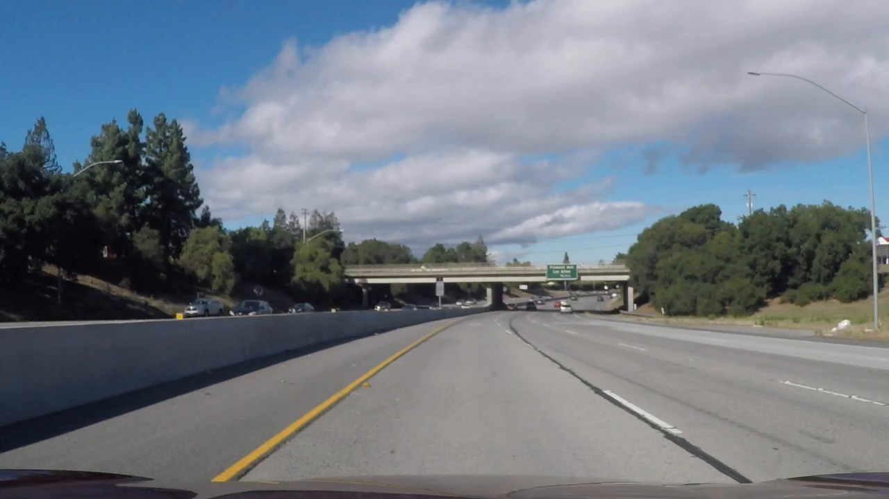
  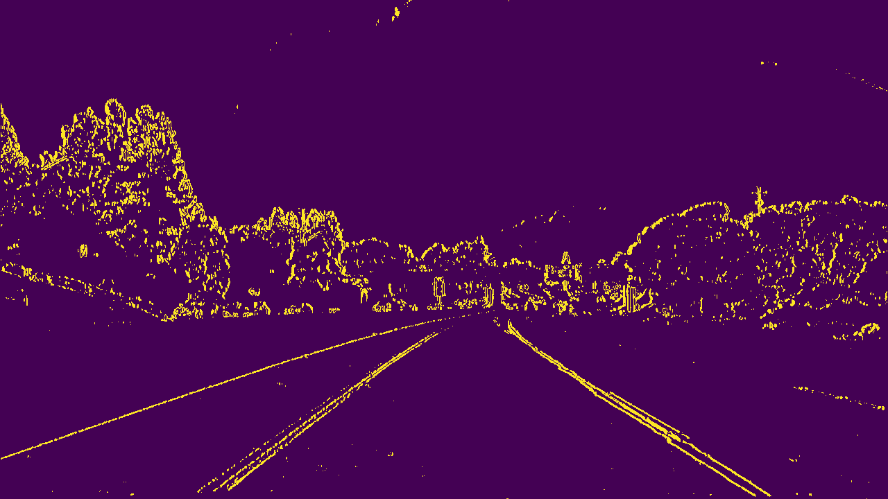 
  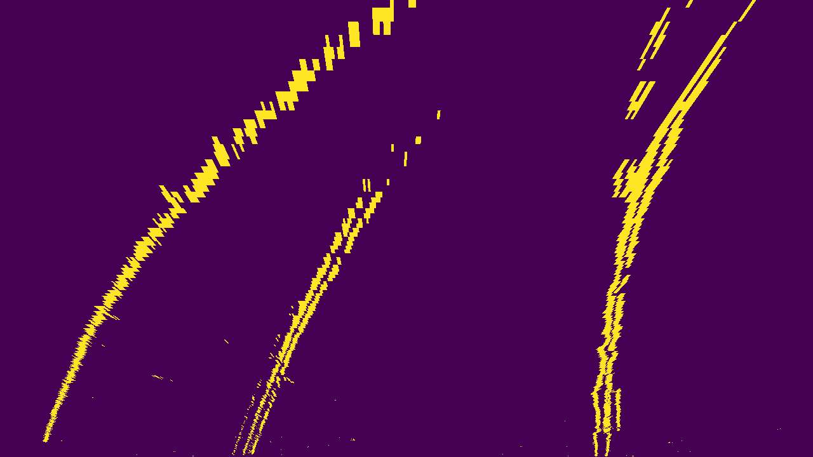
</p>

I tried to play with different threshold of L and S channel. It didn't work. Any hint to make this work is appreciated.